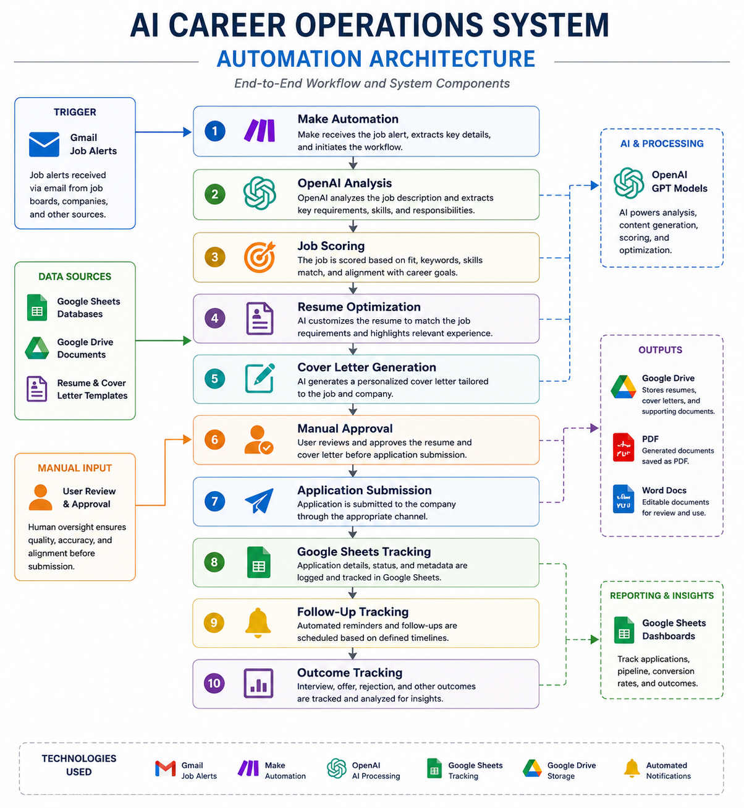

# Automation Architecture

This folder documents the architecture and design of the automation environment supporting the AI Career Operations System.

## Purpose

Automation Architecture documentation explains how systems, tools, and workflows interact to support job-search operations.

## Technology Stack

- Make
- OpenAI
- Gmail
- Google Drive
- Google Docs
- Google Sheets
- GitHub

## Documentation Areas

- System architecture
- Data flows
- Automation workflows
- Integration design

- # Automation Architecture

## AI Career Operations System Architecture

Illustrates the technologies, integrations, data flows, automation components, and operational processes that support the AI Career Operations System.
